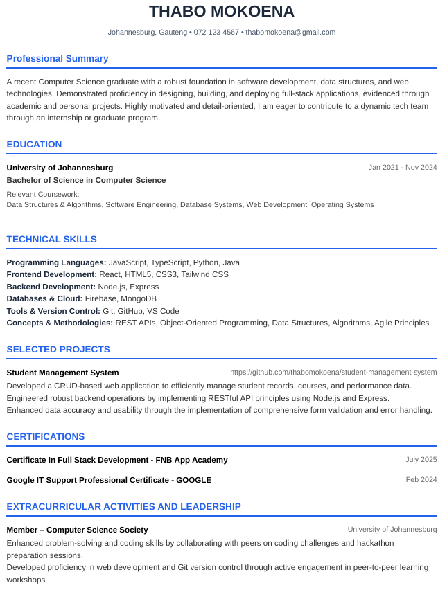

# 🚀 ATS Optimizer (South Africa Edition)


> **The #1 AI-Powered CV Builder tailored for the South African Job Market 🇿🇦**

ATS Optimizer is a full-stack SaaS application designed to help job seekers beat automated screening bots (ATS). It leverages **Google Gemini LMM** to rewrite generic experience into impactful, result-oriented bullet points and uses **Puppeteer** to generate high-fidelity, ATS-compliant PDFs.

---

## 🔗 Live Demo

👉 **Launch App:**  
https://ats-optimizer-gyr8-git-main-naledi-motaungs-projects.vercel.app/

---

## 📸 Application Preview



> *Screenshot reflects the latest beta build.*

---

## ✨ Key Features

### 🇿🇦 Built for the South African Market
- **SA-Standard CV Layouts:** Clean, single-column formats preferred by local recruiters and HR systems.
- **Graduate-Friendly:** Includes sections for leadership, activities, and projects to support internships and learnerships.
- **Government-Ready:** Supports plain, compliant layouts suitable for public sector roles.

---

### 🤖 AI-Powered CV Optimization
- **Smart Rewriting:** Uses **Google Gemini AI** to transform basic inputs into professional, results-driven bullet points.
- **ATS Keyword Matching:** Analyzes job descriptions and recommends relevant hard skills and keywords.
- **Section-by-Section Enhancement:** Users can optimize summaries, experience, skills, and projects individually.

---

### 📄 High-Fidelity PDF Generation
- **Server-Side Rendering:** Uses **Puppeteer (Headless Chrome)** to generate PDFs.
- **ATS-Compliant Output:** Text-based PDFs (no images or tables) to ensure accurate ATS parsing.
- **Real-Time Preview:** React-based live preview updates instantly as users type.

---

### 🔐 Security & Payments
- **Authentication:** Secure login via **Firebase Authentication**.
- **Data Storage:** CV data stored securely in **Firestore**.
- **Payments:** **Paystack** integration ready for premium subscriptions (POPIA-aware).

---

## 🛠️ Tech Stack

### Frontend
- **React (Vite)** – Fast, modern UI
- **TypeScript** – Strict typing for reliability
- **Tailwind CSS** – Utility-first responsive styling
- **Context API** – Global CV state management

### Backend
- **Node.js & Express** – REST API
- **Puppeteer** – PDF generation
- **Google Gemini API** – AI text enhancement
- **Firebase Admin SDK** – Secure server-side operations

---

## 🚀 Local Installation Guide

### 1️⃣ Clone the Repository
```bash
git clone https://github.com/naledi901/ats-optimizer.git
cd ats-optimizer
2️⃣ Backend Setup
bash
Copy code
cd backend
npm install

# Create a .env file with:
# PORT=5000
# GEMINI_API_KEY=your_key
# FIREBASE_ADMIN_CREDENTIALS=your_credentials

npm run dev
3️⃣ Frontend Setup
bash
Copy code
cd frontend
npm install

# Create a .env file with your Firebase config
npm run dev
🤝 Contributing
Contributions are welcome and appreciated.

Fork the project

Create your feature branch

bash
Copy code
git checkout -b feature/AmazingFeature
Commit your changes

bash
Copy code
git commit -m "Add AmazingFeature"
Push to the branch

bash
Copy code
git push origin feature/AmazingFeature
Open a Pull Request

👨‍💻 Author
Naledi Motaung

GitHub: https://github.com/naledi901

Project: https://github.com/naledi901/ats-optimizer

Built with ❤️ for South African job seekers 🇿🇦
